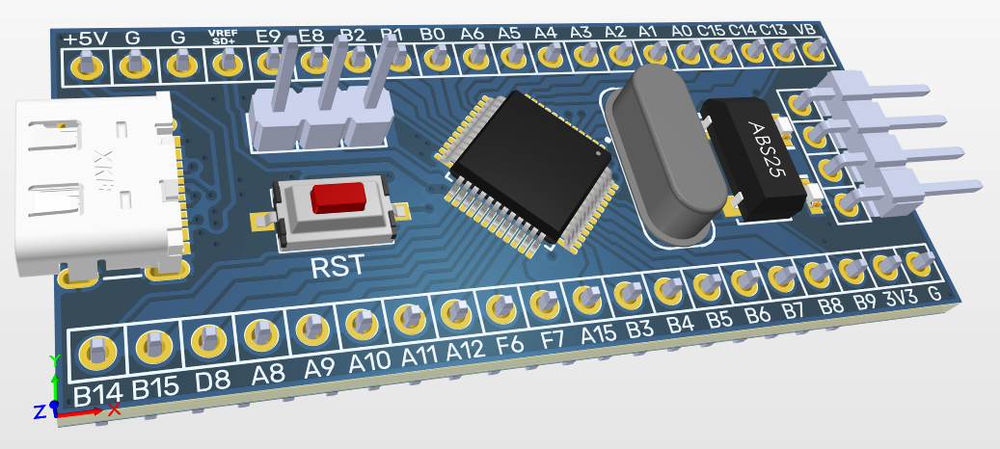
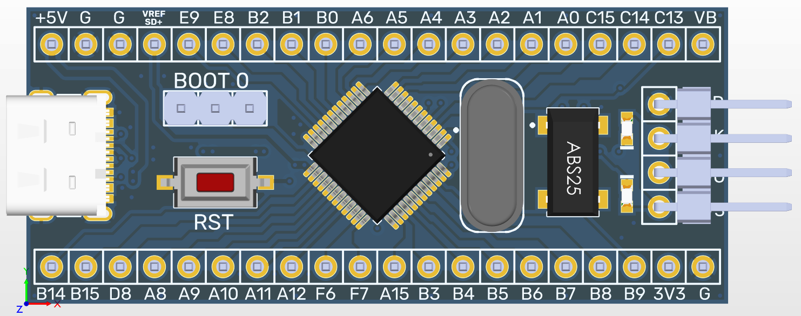
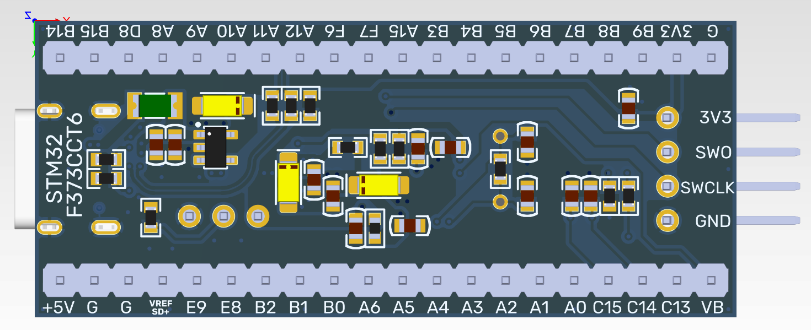
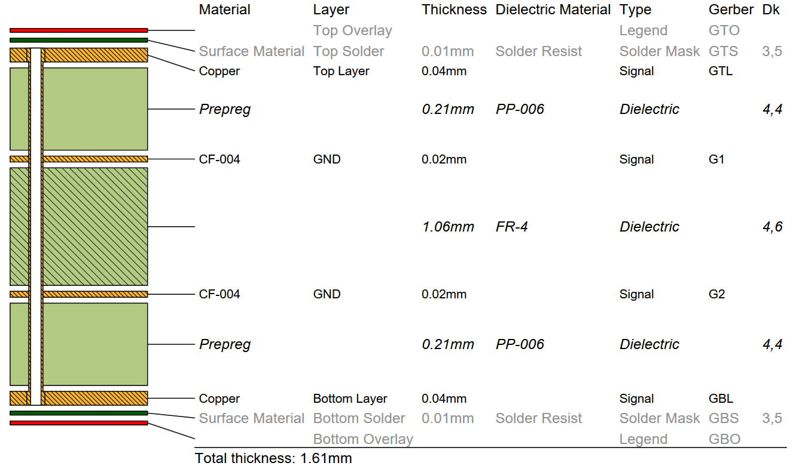

# STM32F373CxT6 Blue Pill
STM32F373CxT6 development board project, designed in Altium, for proper use of the Sigma Delta ADC

  
  

Yes, it would have been possible to use a smaller quartz crystal, etc., but I just wanted to make it look like the original Blue Pill.

## Stackup
It is a 4 layer board which provides proper grounding. The stack parameters for proper USB port operation are as follows:

  

This is the default stackup of one of those Chinese factories.
